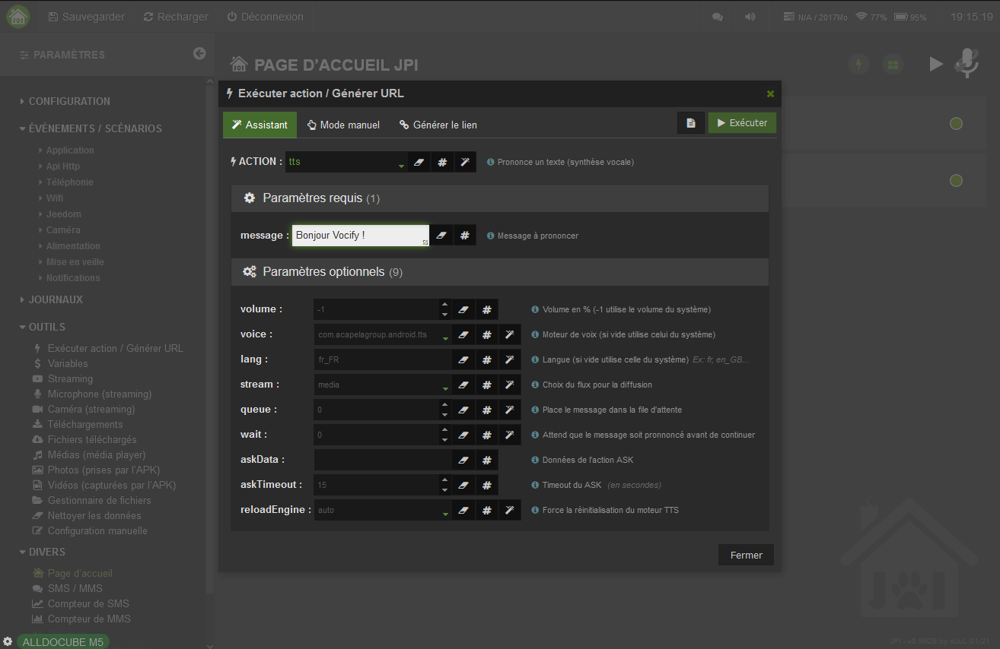

# JPI

_**J**eedom **P**aw **I**nterface_ alias ***JPI*** est un mini contrôleur domotique pour Android.

Il permet de faire à peut près tout ce que l’appareil android est capable de faire, avec un accès par une interface web complète et une API de contrôle complète en http.

C'est son API TTS qui va etre utilsée ici.

## Liens utiles

* [Lien officiel et documentation](https://community.jeedom.com/t/jpi-apk-android-tel-android-dedie-domotique/)
* [Téléchargement du serveur (APK)](http://rulistaff.free.fr/JPI/getJPI/)
* [Soutenir l'auteur _dJuL_](https://www.paypal.com/paypalme/dJuL)

## Test préalable

Aller sur votre interface JPI un fois installé, puis tester la fonction suivante :

1. Menu > Outils > Executer une action 
2. Selectionner une action > Medias > Tts

Ces cette fonctionalité qui sera utilisée par ce présent module de _Voicify_.

## Version

Module 1.0 pour JPI v0.9929

## Paramétrage
* **host** : URL/IP de l'appareil executant l'application
* **port** : Port où écoute l'application
* **volume** : Volume du texte prononcé
* **stream** : Canal audio Android sur lequel jouer le texte (conseillé : media)
* **queue** : Si le texte doit tre mis en file d'attente 1,
* **wait** : Attendre que le message soit fini de prononcer pour continuer
* **maxTextLenght** : Longeur de texte maximum supporté par le système 
	- Taille max approximative 700
	- Si dépassée, les textes seront découpés en plusieurs appels séparés, automatiquement par lot de phrases.

## Aperçu

